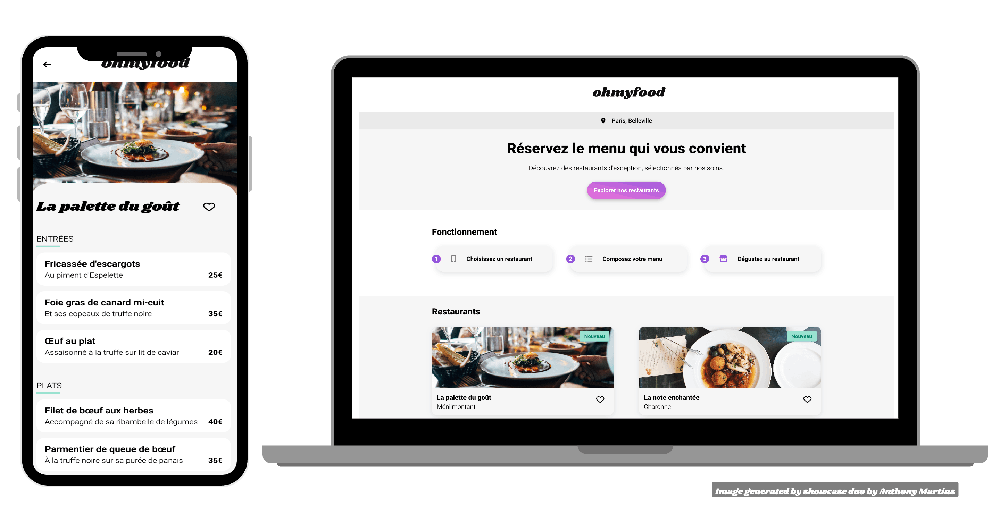

# OhMyFood - Intégration d'une interface mobile-first avec animations CSS

## Aperçu du projet

## Description du projet

Réalisation dans le cadre de ma formation d'intégrateur web chez OpenClassrooms.  
Il consiste à développer une interface mobile-fitst pour une start-up nommée OhMyFood, spécialisée dans la réservation de menus dans des restaurants gastronimiques. 
Le projet inclut l'intégration des maquettes fournies sur Figma ([voir la maquette](https://www.figma.com/design/E4aL7CBi7SPEXhw6JRSQ0t/ARCHIVE-Maquettes-Ohmyfood-(mobile-et-desktop)?node-id=0-1&t=7fF59cTmtuBJQzrL-0)) en utilisant Sass et l'implémentation d'animations CSS pour améliorer l'expérience utilisateur.

## Démo en ligne

Vous pouvez consulter le projet en ligne via GitHub Pages : [OhMyFood sur GitHub Pages](https://martins-anthony.github.io/ohmyfood/)

## Objectifs

- 
 : Développer une interface utilisateur qui s'adapte d'abord aux mobiles, puis aux autres formats (tablettes, desktops).
-  : Mettre en oeuvre des animations CSS pour rendre l'interface plus interactive et engageante.
- **Utilisation de ** : Structurer et optimiser le CSS en utilisant SCSS, un préprocesseur CSS.
- 
 : Utiliser Git et GitHub pour versionner le projet.

## Fonctionnalités

- 
 : L'interface est entièrement responsive, optimisée pour une expérience fluide sur mobile, tablette et desktop.
-  : Des animations au survol et à l'interaction des éléments pour une navigation enrichie.
-  : Affichage des menus de restaurants gastronomiques avec la possibilité de personnaliser les commandes.
-  : Structure du code CSS en plusieurs fichiers pour une meilleur organisation et maintenabilité.

## Auteur

  
